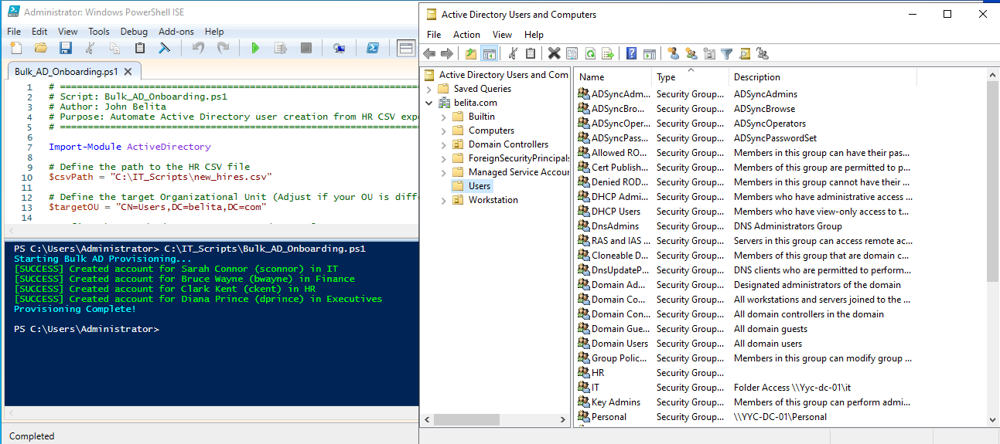
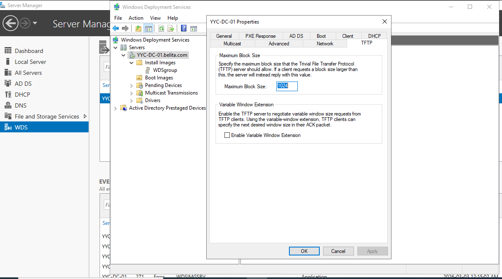
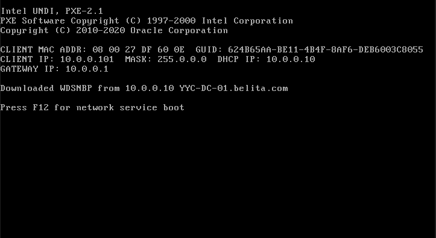
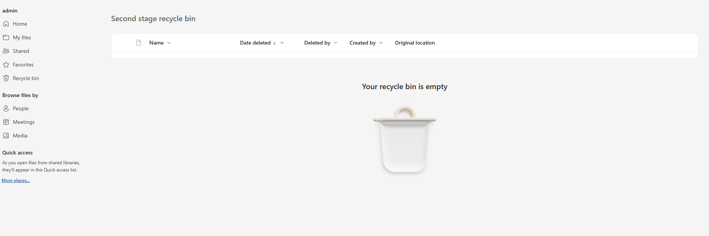

# 🛡️ IT Support Enterprise Lab Portfolio

**Administrator:** John Belita  
**Location:** Calgary, AB | **Email:** johnalbertbelita@gmail.com  
**Certifications:** CompTIA Security+ (2026)

---

## 🚀 Project Overview

Welcome to my technical portfolio. This repository documents my hands-on proficiency in enterprise IT support, bridging the gap between my **Cybersecurity and Networking** education and real-world Service Desk operations.

To demonstrate readiness for IT Support roles, I engineered a comprehensive **Enterprise Home Lab**. This hybrid environment simulates the daily responsibilities of a Service Desk Analyst: from resolving complex end-user incidents to managing identity lifecycles (IAM), enforcing endpoint security, and administering hybrid cloud identities within **Microsoft 365** and **Exchange Online**.

### 🛠️ Tech Stack & Tools
* **Infrastructure:** Windows Server 2022, Windows 11 Pro/10 Enterprise, Oracle VirtualBox
* **Identity & Cloud:** Active Directory (AD DS), Microsoft 365, Microsoft Entra ID, Exchange Online
* **Networking:** DHCP, DNS, Windows Deployment Services (WDS), PXE Boot, TFTP
* **ITSM & RMM:** Jira Service Management, Action1 RMM
* **Security:** Group Policy (GPO), NTFS/RBAC, Principle of Least Privilege (PoLP), PowerShell Automation

---

## 🏗️ Section 0: Infrastructure Implementation
*Building the foundational server environment and promoting the Domain Controller.*

### 0.1 Virtual Machine & Network Config
> Provisioned Windows Server 2022 (2 vCPU, 8GB RAM). Configured a **Static IP (10.0.0.10)** and established secure Shared Folders to simulate mapped network drives.

### 0.2 Domain Controller Promotion (YYC-DC-01)
> Promoted the server to a Domain Controller, establishing the forest root `belita.com`. Verified via **Active Directory Users and Computers (ADUC)**.

---

## 💻 Section 1: Client Workstation Deployment
*Joining a Windows 11 Pro endpoint to the corporate domain.*

* **DNS Alignment:** Manually pointed Client DNS to the Domain Controller (10.0.0.10) to ensure proper SRV record resolution.
* **Domain Join:** Successfully authenticated and joined the `belita.com` domain.

---

## 📂 Section 2: Identity & Access Management (IAM)
*Demonstrating user lifecycle management and organizational structure.*

### 2.1 OU Design & User Provisioning
> Designed a hierarchical OU structure (Admins, Users, Service Accounts). Provisioned accounts manually with standardized naming conventions and enforced **Account Expiry/Logon Hour** restrictions.

---

## ⚡ Section 3: Scripting & Automation (PowerShell)
*Eliminating manual data entry and optimizing the HR-to-IT onboarding pipeline through scripting.*

### 3.1 Bulk Identity Provisioning
> Engineered a **PowerShell automation script** (`Import-Csv`, `New-ADUser`) to ingest standardized HR onboarding spreadsheets and automatically provision Active Directory accounts en masse. 

### 3.2 Standardization & Security Enforcement
> The script dynamically generates standardized `SamAccountNames` (FirstInitial + LastName), populates organizational attributes (Department, Title), and enforces strict security baselines by setting a complex temporary password and triggering the `-ChangePasswordAtLogon $true` flag to ensure Zero Trust compliance upon initial user sign-in.

### 3.3 Business Impact
> **Process Improvement:** Reduced standard new-hire provisioning time from ~5 minutes per user manually to under 2 seconds for a bulk batch, completely eliminating Helpdesk typos and localized human error during the identity lifecycle phase.

---

## 🗄️ Section 4: File Server & RBAC
*Implementing Role-Based Access Control and secure data segregation.*

* **Security Groups:** Managed access via groups (e.g., `IT_Access`, `HR_Access`) rather than individual users to ensure scalability.
* **Validation:** Confirmed "Access Denied" triggers for unauthorized users to verify NTFS permission inheritance.

---

## ⚙️ Section 5: Group Policy & Hardening
*Automating security protocols across the domain.*

* **Password Policy:** Enforced 12-character minimums and 90-day rotations.
* **Account Lockout:** Configured a 3-attempt threshold to mitigate brute-force risks.
* **Validation:** Verified the "Account Locked" message on the client-side after failed attempts.

---

## ☁️ Section 6: Modern Fleet Management (Action1 RMM)
*Cloud-based vulnerability remediation and patch management.*

* **AD Connector:** Synced on-premise assets to the cloud for real-time visibility.
* **Patch Management:** Identified critical **CVEs** and executed automated remediation workflows.
* **Software Deployment:** Silently deployed 3rd-party apps (7-Zip) via RMM.

---

## 🎫 Section 7: ITSM (Jira Service Management)
*Managing the ticket lifecycle and meeting Service Level Agreements (SLAs).*

### 7.1 SLA Engineering & Triage
> Engineered custom SLAs: **15m Time to First Response** and **2h Resolution**. Used **JQL** (Jira Query Language) to prioritize critical incidents.

### 7.2 Incident Management Case Study
* **Issue:** HR Department lost access to a critical shared drive.
* **Root Cause:** Security Group was accidentally stripped from the folder's ACL.
* **Resolution:** Restored RBAC permissions, verified inheritance, and documented the fix in Jira Internal Notes for knowledge base (KB) creation.

---

## 💿 Section 8: Automated OS Deployment (WDS)
*Architecting a PXE Boot environment for bare-metal provisioning.*

* **Image Management:** Extracted and published `boot.wim` and `install.wim` images.
* **Troubleshooting:** Resolved **UDP Port 67** conflicts with DHCP and optimized **TFTP Block Size** to fix packet fragmentation (Error 1460).
* **Execution:** Successfully deployed Windows 10 to a bare-metal client via network boot.

---

## ☁️ Section 9: Hybrid Cloud Identity & Exchange Online Administration
*Bridging on-premise Active Directory with Microsoft 365 and Entra ID to simulate a modern enterprise environment.*

### 9.1 Cloud Identity Synchronization (Entra Connect)
> Configured Alternative UPN Suffixes and deployed **Microsoft Entra Connect Sync**. Verified the successful replication of local user identities and password hashes into the Microsoft 365 Admin Center.

### 9.2 Service Request Fulfillment: Identity & Security
> **MFA Reset & Authentication Management**
> Fulfilled a high-priority request for a user locked out of their account. Navigated the Microsoft Entra ID "Authentication Methods" pane to require re-registration of Multi-Factor Authentication (MFA), ensuring secure identity verification.

### 9.3 Lifecycle Management: Employee Offboarding
> **User Deactivation & Mailbox Conversion**
> Executed a standard offboarding workflow for a departing employee (Neil Nepu). This involved blocking sign-in to secure the account and converting the user mailbox to a **Shared Mailbox** to preserve data integrity while reclaiming the Microsoft 365 license.

### 9.4 Data Recovery & Compliance
> **OneDrive Second-Stage Recovery**
> Demonstrated technical proficiency in SharePoint/OneDrive architecture by accessing the **Second-Stage Recycle Bin**. This allows for the recovery of critical business data even after a user has emptied their primary recycle bin, mitigating accidental or malicious data loss.

### 9.5 Mail Flow Troubleshooting
> **Message Trace Execution**
> Utilized the Exchange Admin Center (EAC) to perform a Message Trace, diagnosing mail delivery success and identifying EOP (Exchange Online Protection) filtering actions for external inbound traffic.

---

## 💬 Section 10: ChatOps & Automation (Microsoft Teams Integration)
*Optimizing team collaboration and end-user support via Jira-Teams Integration.*

### 10.1 Real-Time Incident Notifications
> Integrated **Jira Service Management with Microsoft Teams** channels to provide the IT team with instant visibility into high-priority incidents. This reduces "Mean Time to Acknowledge" (MTTA) by allowing technicians to view ticket details without leaving the chat interface.

### 10.2 Conversational Ticketing
> Enabled the **Jira Cloud app for Teams**, allowing end-users to create, track, and comment on support tickets directly from a Teams chat.
* **Impact:** Increased user adoption of the Service Desk and reduced "shadow IT" requests made via private DM.

### 10.3 Agent Productivity (Assist)
> Leveraged **Jira Assist** within Teams to allow agents to transition chat conversations directly into formal tickets with a single click, ensuring all support interactions are captured for SLA reporting and KB documentation.

---

## 📜 Education & Certifications

* **CompTIA Security+** | Certified Jan 2026
* **Diploma in Cybersecurity** | ABM College, Calgary, AB | Graduated May 2025
* **Network Specialist Training** | SAIT, Calgary, AB | 2019

---

## 📫 Contact
**John Belita** | Calgary, AB | johnalbertbelita@gmail.com
