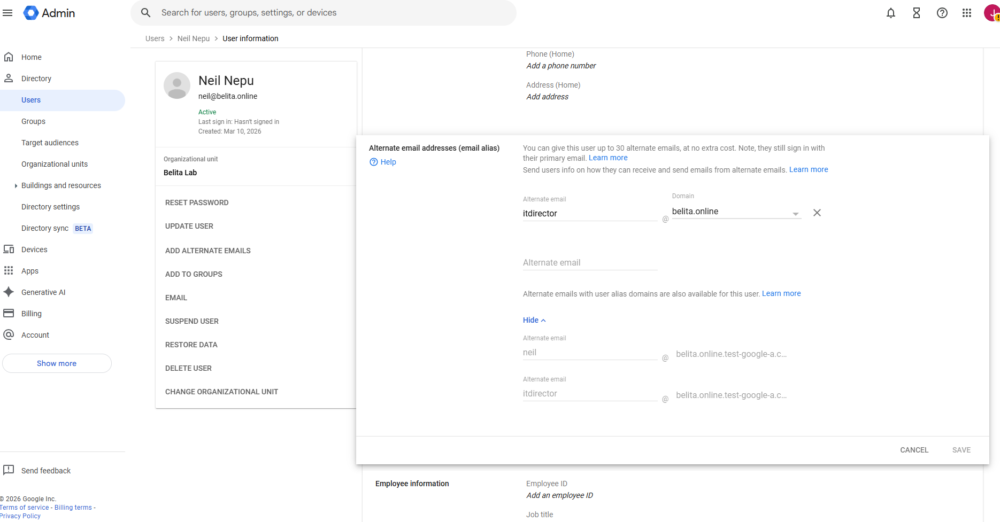
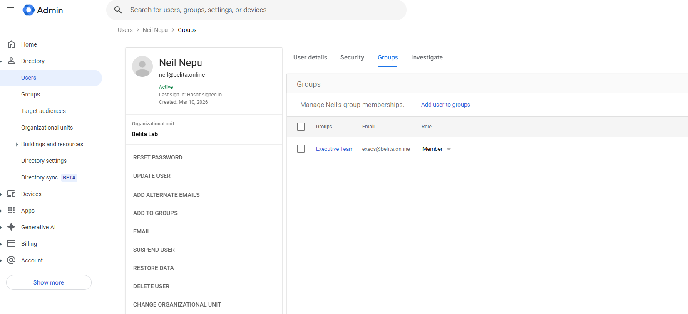
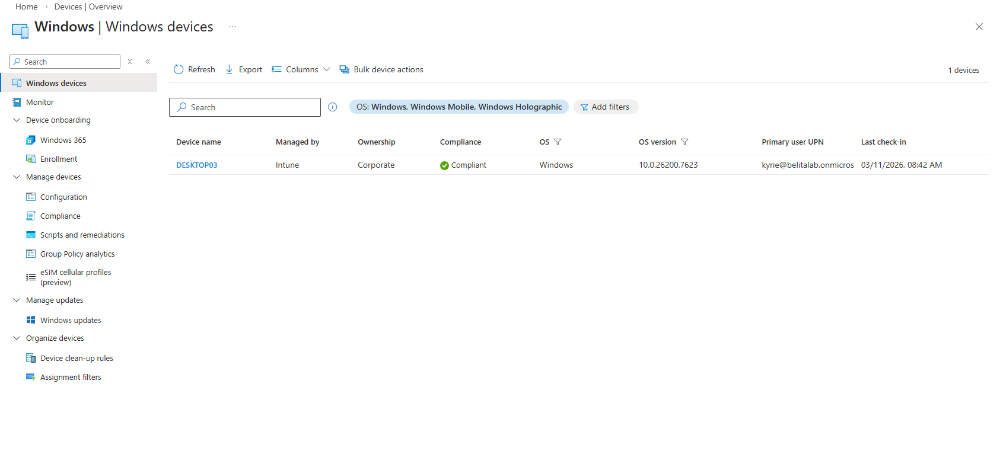

# 🛡️ IT Support Enterprise Lab Portfolio

**Administrator:** John Belita  
**Location:** Calgary, AB | **Email:** johnalbertbelita@gmail.com  
**Certifications:** CompTIA Security+ (2026)

---

## 🚀 Project Overview

Welcome to my technical portfolio. This repository serves as documented proof of my hands-on proficiency in enterprise IT support, bridging the gap between my formal Cybersecurity education and real-world Service Desk operations.

To demonstrate readiness for modern Systems Administration and IT Support roles, I engineered a comprehensive **Enterprise Home Lab**. This hybrid environment simulates the daily responsibilities of a Service Desk Analyst: from resolving complex end-user incidents and managing identity lifecycles (IAM) to enforcing endpoint security and administering hybrid cloud identities across **Microsoft 365**, **Intune**, and **Google Workspace**.

### 🛠️ Tech Stack & Tools
* **Infrastructure:** Windows Server 2022, Windows 11 Pro, Oracle VirtualBox
* **Identity & Cloud:** Active Directory (AD DS), Microsoft 365, Google Workspace, Microsoft Entra ID
* **Endpoint Management:** Microsoft Intune (MDM), Action1 RMM, WDS (PXE Boot)
* **Network & Security:** DHCP, DNS, MX/SPF/DMARC, Group Policy (GPO), NTFS/RBAC
* **ITSM & Automation:** Jira Service Management, Microsoft Teams ChatOps, PowerShell

---

## 🏗️ Section 0: Infrastructure Implementation
*Architecting the foundational server environment and promoting the Domain Controller.*

### 0.1 Virtual Machine & Network Configuration
Provisioned a Windows Server 2022 instance with optimized resource allocation. Configured a **Static IP (10.0.0.10)** to ensure reliable DNS resolution and established secure Shared Folders to simulate mapped corporate network drives.

***Figure 1: Virtual machine hardware and resource allocation.***

***Figure 2: Assigning the static IPv4 configuration for the Domain Controller.***

### 0.2 Domain Controller Promotion (YYC-DC-01)
Promoted the server to a Domain Controller, establishing the forest root `belita.com`. Verified successful directory deployment via **Active Directory Users and Computers (ADUC)**.

***Figure 3: Active Directory Domain Services role installation.***

***Figure 4: Successful deployment of the belita.com Active Directory forest.***

---

## 💻 Section 1: Client Workstation Deployment
*Joining a Windows 11 Pro endpoint to the corporate domain network.*

### 1.1 DNS Alignment & Domain Join
Manually configured the Client DNS to point to the local Domain Controller (10.0.0.10) to ensure proper SRV record resolution. Successfully authenticated and joined the workstation to the `belita.com` domain.

***Figure 5: Aligning client DNS to the primary Domain Controller.***

***Figure 6: Windows 11 endpoint successfully joined to the local domain.***

---

## 📂 Section 2: Identity & Access Management (IAM)
*Demonstrating user lifecycle management and organizational structure.*

### 2.1 OU Design & User Provisioning
Designed a hierarchical Organizational Unit (OU) structure to logically separate Admins, Users, and Service Accounts. Provisioned accounts utilizing standardized corporate naming conventions.

***Figure 7: Segmented OU architecture for granular policy application.***

### 2.2 Security Restrictions
Enforced strict **Account Expiry** and **Logon Hour** restrictions to mitigate the risk of unauthorized access outside of authorized business hours.

***Figure 8: Enforcing time-based logon restrictions on a standard user account.***

---

## ⚡ Section 3: Scripting & Automation (PowerShell)
*Optimizing the HR-to-IT onboarding pipeline to eliminate manual data entry errors.*

### 3.1 Bulk Identity Provisioning
Engineered a **PowerShell automation script** utilizing `Import-Csv` and `New-ADUser` to ingest standardized HR spreadsheets and dynamically provision Active Directory accounts en masse. The script dynamically generates `SamAccountNames` and enforces Zero Trust security baselines by setting complex temporary passwords and triggering the `-ChangePasswordAtLogon $true` parameter.

***Figure 9: Executing the bulk onboarding script via PowerShell ISE.***

---

## 🗄️ Section 4: File Server & RBAC
*Implementing Role-Based Access Control and secure data segregation.*

### 4.1 Security Groups & Access Validation
Managed file share access strictly via Security Groups (e.g., `IT_Access`, `HR_Access`) rather than individual users to ensure scalable management. Confirmed "Access Denied" triggers for unauthorized users to verify NTFS permission inheritance.

***Figure 10: Configuring NTFS permissions using explicit Security Groups.***

***Figure 11: Verifying successful RBAC enforcement (Access Denied for unauthorized user).***

---

## ⚙️ Section 5: Group Policy & Hardening
*Automating security protocols across the domain utilizing GPOs.*

### 5.1 Password Policy & Account Lockout
Deployed domain-wide Group Policy Objects (GPOs) to enforce a strict 12-character minimum password policy with 90-day rotations. Configured a 3-attempt Account Lockout threshold to mitigate brute-force attacks.

***Figure 12: Domain-wide password complexity and history requirements.***

### 5.2 Security Validation (Simulated Attack)
Simulated a brute-force attempt against a user account and verified the "Account Locked" message on the client-side after failed attempts, confirming successful GPO enforcement.

***Figure 13: Client-side validation of the Active Directory lockout policy.***

---

## ☁️ Section 6: Modern Fleet Management (Action1 RMM)
*Executing cloud-based vulnerability remediation and patch management.*

### 6.1 Vulnerability Management & Patching
Synced on-premise assets to the cloud via the Action1 RMM agent. Identified critical **CVEs** through automated vulnerability scans and executed patch remediation workflows to secure outdated endpoints.

***Figure 14: Action1 dashboard displaying critical missing updates and CVEs.***

***Figure 15: Successful execution of the automated Windows patch remediation workflow.***

---

## 🎫 Section 7: ITSM & ChatOps (Jira + Teams)
*Managing the incident lifecycle and reducing MTTA (Mean Time To Acknowledge).*

### 7.1 SLA Engineering & Triage
Engineered custom Jira SLAs (15m Response / 2h Resolution). Utilized **JQL** (Jira Query Language) to properly prioritize critical incidents through the IT Service Desk queue.

***Figure 16: Managing the active Jira Service Management incident queue.***

***Figure 17: Successfully documenting and resolving an end-user ticket.***

### 7.2 Microsoft Teams Integration (Process Improvement)
Integrated **Jira with Microsoft Teams** via Webhooks, enabling end-users to generate IT tickets directly from chat messages. IT Agents receive automated alerts in a dedicated Teams channel for high-priority incidents.

***Figure 18: Engineering the webhook integration between Teams and Jira.***

***Figure 19: Seamless creation of a trackable Jira incident directly from MS Teams.***

---

## 💿 Section 8: Automated OS Deployment (WDS)
*Architecting a PXE Boot environment for bare-metal OS provisioning.*

### 8.1 Image Management & Troubleshooting
Extracted and published `boot.wim` and `install.wim` images to the WDS Server. Resolved **UDP Port 67** conflicts with the co-hosted DHCP server and optimized the TFTP Block Size to fix packet fragmentation.

***Figure 20: Tuning the TFTP Maximum Block Size registry key to resolve PXE boot errors.***

### 8.2 PXE Boot Execution
Successfully deployed a Windows 10 image to a bare-metal client via network boot.

***Figure 21: Bare-metal client successfully fetching the boot image over the network.***

---

## ☁️ Section 9: Hybrid Cloud Identity (Entra ID)
*Bridging on-premise Active Directory with the Microsoft 365 Cloud.*

### 9.1 Entra Connect Synchronization
Deployed **Microsoft Entra Connect Sync**. Verified the successful replication of local AD user identities and password hashes into the Microsoft 365 Admin Center, establishing a true hybrid environment.

***Figure 22: On-premise Active Directory accounts successfully synced to Microsoft 365.***

---

## 🛠️ Section 10: Service Desk Troubleshooting (Break/Fix)
*Simulated resolution of common Tier 1/Tier 2 support requests typical of an MSP environment.*

### 10.1 Ticket 1: MFA Reset (Entra ID)
* **Scenario:** User lost access to their Authenticator app after replacing their mobile device. 
* **Resolution:** Navigated to Entra ID Authentication Methods, executed **Require re-register MFA**, and revoked active sessions to secure the account during the device transition.

### 10.2 Ticket 2: Secure Offboarding (Mailbox Conversion)
* **Scenario:** Immediate termination of an employee requiring access revocation and data retention.
* **Resolution:** Disabled the AD account, forced a Delta Sync, and converted the Exchange Online inbox to a **Shared Mailbox** to retain historical data while successfully reclaiming the paid M365 Business Premium license.

### 10.3 Ticket 3: Data Recovery (OneDrive)
* **Scenario:** User permanently deleted files from their OneDrive and emptied the local Recycle Bin.
* **Resolution:** Generated administrative access to the user's SharePoint Site Collection and successfully recovered the files from the hidden **Second-Stage Recycle Bin**.

---

## ☁️ Section 11: Cloud SaaS Administration (Google Workspace)
*Demonstrating platform-agnostic administration and strict email security configuration.*

### 11.1 Tenant Provisioning & Email Security (SPF/DMARC)
Provisioned a **Google Workspace Business Standard** tenant. Hardened organizational mail flow by configuring strict **MX, SPF, and DMARC** DNS records to prevent domain spoofing and phishing.

### 11.2 User Lifecycle & Alias Management
Executed standardized user provisioning workflows. Managed organizational email routing by configuring secondary **Email Aliases** (`itdirector@belita.online`), providing flexible mail delivery without supplementary licensing costs.

***Figure 23: Managing Google Workspace users and organizational email aliases.***

### 11.3 RBAC & Access Control
Engineered **Google Groups** (`execs@...`) to act as centralized security boundaries for Role-Based Access Control (RBAC). Administered organizational access policies and enforced restricted sharing permissions on sensitive data.

***Figure 24: Utilizing Google Groups for department-level access control.***

---

## 📱 Section 12: Modern Endpoint Management (Microsoft Intune)
*Implementing Zero-Touch deployment and MDM policy enforcement for a remote workforce.*

### 12.1 MDM Enrollment & Entra ID Join
Orchestrated the enrollment of Windows 11 endpoints into **Microsoft Intune** (Entra ID Joined), enabling over-the-air (OTA) management without requiring a VPN or local Domain Controller line-of-sight.

***Figure 25: Windows endpoint successfully enrolled and managed via Microsoft Intune.***

### 12.2 Configuration Profiles & Compliance
Engineered and deployed **Configuration Profiles** to enforce enterprise security baselines, including automated screen-lock timers, Microsoft 365 app deployments, and alphanumeric password complexity.

***Figure 26: Intune successfully pushing configuration profiles to the client device.***

---

## 🎓 Section 13: Capstone - End-to-End Employee Onboarding
*Executing a complete, enterprise-grade onboarding process by unifying ITSM, AD DS, Entra ID, M365, and Intune into a single operational pipeline.*

### 13.1 The Workflow Execution
1. **Intake:** Generated a New Hire Request in Jira Service Management for 'Jennifer Belita'.
2. **Identity:** Utilized the custom PowerShell script to automatically build the AD account, assign it to the `Finance_Access` security group, and enforce a temporary password.
3. **Cloud Sync:** Executed a forced Delta Sync (`Start-ADSyncSyncCycle`) to immediately push the identity to Entra ID.
4. **Licensing:** Assigned an M365 Business Premium license via the cloud admin center to provision Exchange Online.
5. **Endpoint & Access:** Authenticated into the Intune-managed Windows 11 laptop using cloud credentials, verified SSO via Edge, and successfully accessed the locked-down `\\10.0.0.10\Finance` local file share via inherited Kerberos authentication.
6. **Closure:** Documented the technical steps in the Jira internal notes and resolved the ticket within SLA limits.

***Figure 27: The completed pipeline—Local AD identity synced to M365, licensed, and ticket resolved.***

---

## 📜 Education & Certifications

* **CompTIA Security+** | Certified Jan 2026
* **Diploma in Cybersecurity** | ABM College, Calgary, AB | Graduated May 2025
* **Network Specialist Training** | SAIT, Calgary, AB | 2019

---

## 📫 Contact
**John Belita** | Calgary, AB | johnalbertbelita@gmail.com
